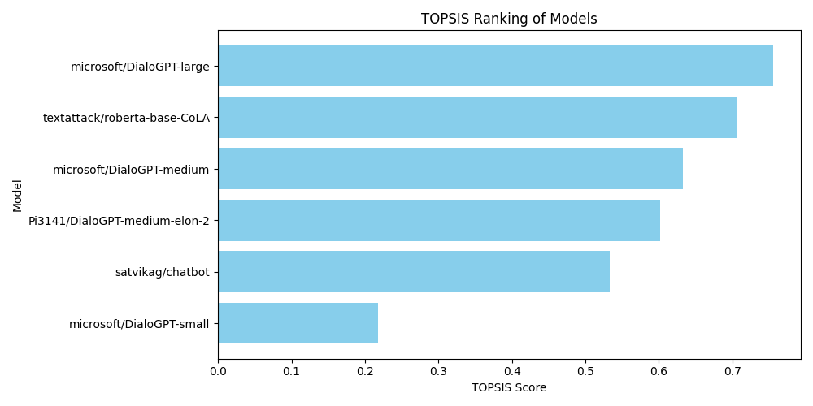

# Conversational AI Model Evaluation 🧠🤖



A comprehensive evaluation framework for comparing pre-trained conversational AI models using multiple NLP metrics. **This project builds on and integrates components from my [previous project of topsis] (https://github.com/Sumit0504/Topsis_Sumit_102203514) for evaluation.**

## Overview 📌
This project evaluates 6 pre-trained conversational models (like DialoGPT variants) on 5 diverse prompts to assess:
- **Response quality** (ROUGE, F1-Score)
- **Fluency** (Perplexity, Response Length)
- **Grammatical correctness** 
- **Ranking** (TOPSIS methodology)

**Key Integration**:  
Reused and extended evaluation logic (e.g., `calculate_rouge`, `calculate_perplexity`) from my [earlier project](link_to_previous_project_repo) focused on summarization models, adapting it for conversational AI use cases.

---

## Integration with Previous Work 🔄
This project leverages code and methodologies from my **[previous NLP evaluation project](link_to_previous_project_repo)**:
1. **Shared Components**:
   - **Metric Calculation**: ROUGE, F1, and perplexity logic reused with minor adaptations for conversational responses.
   - **Visualization Pipeline**: Code for plotting metrics (e.g., `matplotlib` templates) directly imported.
   - **TOPSIS Ranking**: Ranking algorithm from prior work applied here for model comparison.

2. **Enhancements**:
   - Added support for **conversational-specific metrics** (e.g., response length analysis).
   - Integrated **Hugging Face models** instead of custom-trained summarization models.
   - Improved visualization readability for multi-model comparisons.

---

## Project Structure 🌳 (Updated)

- **evaluate_models.py: Main script for evaluating language models and performing analysis. -results.csv: CSV file containing detailed evaluation results.**
- **topsis.csv: CSV file containing TOPSIS analysis results.**
- **topsis_BarGraph: Bar graph visualizing TOPSIS scores.**


---

## Key Files 📄
| File | Description |
|------|-------------|
| `eval.py` | Runs model evaluation, calculates metrics, and generates results/plots |
|  | Contains average scores for ROUGE, F1, Perplexity, etc. per model |
| `final.csv` | Final ranking using TOPSIS (Technique for Order Preference by Similarity) |
| `*_comparison.png` | Visual comparisons of individual metrics across models |
 ---
## Dependencies ⚙️
- Python 3.7+
- Core: `nltk`, `torch`, `transformers`
- Metrics: `rouge-score`, `bert-score`, `sklearn`
- Visualization: `matplotlib`, `pandas`
---
## Install all requirements:
```bash
pip install -r requirements.txt
python -m nltk.downloader popular  # Download NLTK data